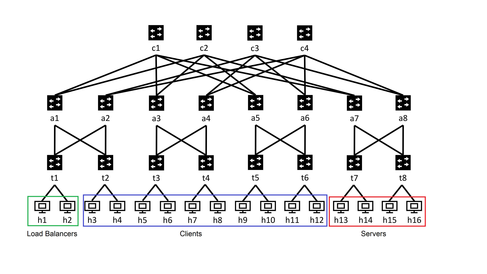

# Load balancing project

## Objectives
- Implement software load balancers
- Use VIP and IPinIP to deliver traffic
- Understand the benefit of Direct Server Return(DSR)

## Overview
Software load balancers distribute connections from clients among multiple servers. The clients send packets to one *Virtual IP (VIP)*. Load balancers distribute the packets to the VIP to the actual servers with their actual IP addresses, called *destination IPs (DIPs)*. The servers then generate a response and send it back to the client. 

The server can send the response message either back to the Load Balancer and then to the client, or directly to the client. The later case is called *Direct Server Return*.  One benefit of Direct Server Return is that it avoids the load balancer as a bottleneck, as responses from the server are generally larger than the requests from the client. However, it's hard to see performance improvement in our testbed because we run in a simulated environment and the overhead of scapy. 
<!--
Since the software load balancer is going to be implemented using scapy on layer 7, the load balancer doesn't improve performance in our case.
-->

To learn more about load balancing, please take a look at [Ananta](https://dl.acm.org/citation.cfm?id=2486026).


## Getting Started
In this project, we will implement a software load balancer using [scapy](https://scapy.readthedocs.io/en/latest/), a packet parsing package in python.
To install scapy, run `pip install scapy` in the terminal.

## High-level sketch of the implementation.
As usual, we use the fattree topology. We set `h1` and `h2` as load balancers, `h3-h12` as clients, and `h13-h16` as servers. We use 20.0.0.1 as our VIP.


When the client sends packets to the VIP (20.0.0.1), the switches need to forward them to the load balancers and use ECMP to split packets among the load balancers (`h1` and `h2`).

Each instance of load balancers listens for packets in the network with destination as the VIP and changes the routes of those packets to one of the four servers, (`h13`, `h14`, `h15`, or `h16`), by encapsulating those packets within another IP packet with a destination of one of the four servers. Load balancers decides which server should receive a certain packet based on a hash of the 5-tuple of that original packet. 

The host agents at the servers then decapsulate the packets and send the original packets to corresponding local server. The server then dirctly sends responses back to the clients without going through the load balancers (i.e., direct server return).

## Dataplane Code
Copy your p4 code from Project 3 (the ECMP Routing Project). This code does not need to be changed for this project.

## Routing Controller
We provided you a routing controller called `routing-controller.py`. This controller currently should be able to write ECMP routing rules for networks of switches running ECMP p4 code. You can test this by changing up the topology (changing the json file that specifies the topology) and running the same controller code. The `pingall` command should work.

For this project, we will modify the `route` function of `routing-controller.py`, so that we can forward all the packets whose destination is the VIP to the load balancers (h1 and h2).

**Hint 1:** Given that both load balancers h1 and h2 are under t1, for all the switches other than `t1`, we just need to ensure packets to the VIP go to the t1 rack.
**Hint 2:** At `t1`, consider using ECMP rules to split up packets to the VIP equally between the two load balancers.

### Testing the Routing Controller
#### Test 1
```
sudo p4run --conf fat_tree_one_pod_app.json
```
then run `pingall` in mininet. If all pings go through, then your routing should work for normal packet routing.
#### Test 2
run
```bash
sudo tcpdump -enn -i t1-eth1
```
and
```bash
sudo tcpdump -enn -i t1-eth2
```
so we can monitor the packets going to h1(through t1-eth1) and the packets going to h2(through t1-eth2).
Now if you run
```
mininet>h5 ping 20.0.0.1
```
then you should see only packets going to one of the load balancers. If you run ping from another host, the load balancer that receives the packet may change. Try to ping from different hosts to verify that your switches are dividing the flows amoung the two load balancers correctly. The load balancer should not be replying to the ping, so don't worry if the ping fails. As long as you see the packets on the tcpdump, then the routing controller is working properly. 

If you see that packets being destined to 20.0.0.1 are being delivered to h1 or h2, then your routing controller should work.

## Load Balancer
In this section, we will be working with `load_balancer.py`. All of your changes should be made within this file. Then you need to open a terminal of for each load balancer (`h1`, `h2`) and run `load_balancer.py` there.

Our load balancer distributes packets to servers based on hashes in the data plane. Specifically, the load balancer needs to:
1. receive packets
2. encapsulates packets with another IP header
3. select the server(`h13`, `h14`, `h15`, or `h16`) to send to based on a hash of the five tuple of the original packets (inner IP headers)
4. set the destination IP to be the server's IP
5. send the packet


### Sniffing Packets
This section will show you how to read(sniff) packets with scapy

First, we need to import scapy with
``` python
from scapy.all import *
```

To read the incoming packets, we will use the `sniff` function in the scapy package.
This function sniffs for packets and sends them to the function that we pass in the `prn` argument.
We can also add a `filter` argument that can filter packets before passing them into the function.
The filter uses Berkeley Packet Filter(BPF) syntax. Here is the link to some documentation about BPF: https://biot.com/capstats/bpf.html

For example,
``` python
sniff(filter="tcp and dst host 10.1.2.1", prn=do_something)
```
will sniff for packets that use the TCP protocol, and are destined for the IP 10.1.2.1. Then, the packet will be passed into the `do_something` function that we define.

In our case, we need to sniff for TCP packets going to 20.0.0.1.

After you use the sniff function, the meat of the load balancing code will be in the function that the packets are sent to(`do_something`).
Your `do_something` function should have one input parameter called `packet`.

### Forging packets
In order to send the packet to the server, we have to encapsulate the received packet with scapy.

We will encapsulate the packet with IPinIP.
The IPinIP protocol is when you have an IP packet that is encapsulated by another IP header. Thus, the inner packet will be routed based on the outer header, but the information in the inner header will stay the same. The IPinIP protocol is important for DSR, because it gives the server access to the client IP address and the client port.

Here is an example of how to forge a TCP packet with scapy:

```python
packet = Ether() / IP(dst="10.1.2.1") / TCP(sport=333, dport=222)
```
In this case, we want to do IPinIP encapsulation, so you can add on an extra IP header on top of the sniffed packet.

If you want to debug and print out what your packets look like, just use
```python
packet.show() # show packet before computing checksums, etc.
```
 or
```python
packet.show2() # show packet after computing checksums, etc.
```

Specify the destination MAC address to be the closest switch. After you have created your packet, send it with the `sendp` function, which sends the packet at layer 2. 

<!-- sending with `send` to the server doesn't work with scapy, but sendp works. perhaps something to do with IPinIP. when you use `send` command, scapy automatically does ARP and adds an Ether header to it. -->

### Parsing Packets
In order to forge and encapsulate your packets, you will have to do some parsing on the sniffed packets.

Packet headers in scapy are formed of layers. To access these layers, do
```
packet[Ether]
```
Each layer contains all layers after it, for example, `packet[Ether]` includes the IP header, the TCP header, and the data payload. 

Another way to traverse up the header layers is to use `.payload`. For example,
```
packet[IP].payload
```
accesses the TCP header for TCP packets. This is useful when parsing IPinIP headers, as there are two IP headers, and `packet[IP]` will only return the first IP header.

### Hashing
We need to hash each packet's five tuple in order for the load balancer to determine which server to send the packet to.

To hash the five-tuple, you can use any hash function. If you want to consider performance, then you can also use bitwise operators as your hash function.

One option is to use zlib in python. After importing, you can run: `zlib.crc32(bytes(five_tuple)) & 0xffffffff` to hash the five tuple.

### Testing the Load Balancer

In mininet, run:
```
mininet> xterm hW hX hY hZ
```
where W,X,Y,and Z are the host numbers where you are going to send packets to. For testing purposes, you may find it helpful to not do hashing in your load balancing code and only send to one designated host(for example `h16`).

And on each of the external terminals of the servers(`hW hX hY hZ`), run the command
```
sudo tcpdump -enn 
```
so we can monitor the packets arriving at each server hosts.

Next, run the load balancing code on `h1` and/or `h2`.

Now, if you write and run a short python script (or use the provided script `send_packet_to_lb.py`) on a client that sends one TCP packet to 20.0.0.1, then you should see packets arriving at the servers being printed out on the server terminals.

At this point, packets are being sent from the clients and routed to the load balancers, where they are encapsulated and delivered to the servers. The final step is to decapsulate and have a server handle the packets.

## Host Agent
We run PHP web servers at our server nodes (`h13`-`h16`). We can start the web servers by running `php -S 20.0.0.1:80 -t ~/resources/wwwroot` at each server.

In this section, we will work on `agent.py` which also runs on the server nodes. The host agent's job is
1. Decapsulate the IPinIP packets. 
2. Send decapsulated packets to the web server.

### Adding VIP to Interface
After decapsulation, the destination IP of the packet should be the VIP. To ensure that this packet can reach the server, we need to add the VIP to a local interface. This way, the server machine believes that the VIP 20.0.0.1 is one of its own IP addresses, so that it does not push the packets from the host agents back into the network.

We can add the VIP to an interface with the `ip addr add` in the terminal of the server. Since we want to add to the eth0 interface, we will specify that `dev hX-eth0`(with X being the host number). The command should look something like this: `ip address add IFADDR dev STRING`. There is a script called `set_up_servers.sh` that runs these commands on the specified hosts. 

When we run the server, it binds to the VIP address. This means that it can accept decapsulated packets, and also reply with the proper source IP address (VIP). If the server is bound to the host's IP address, and not the VIP address, then the reply is not accepted by the client, as the source was not the IP address that the client originally sent the packets to.

### Decapsulation and Delivery

Receiving the packets should be the same as the load balancer(i.e. with `sniff`). In order to decapsulate, you can use scapy packet parsing.
Sending packets can be done with `send`. You also need to run `conf.L3socket=L3RawSocket` in your python code in order to speak to local applications. The loopback interface is special, so sending packets to your own machine (like we are doing here) requires you to build packets one layer upper (further explanation [here](https://scapy.readthedocs.io/en/latest/troubleshooting.html#i-can-t-ping-127-0-0-1-or-1-scapy-does-not-work-with-127-0-0-1-or-1-on-the-loopback-interface))


## Testing
Remember to run `sudo service lightdm start` to have a GUI.

1. run `xterm` to open an external terminal for the load balancers, clients and servers(you can open many terminals with 1 command through something like this `xterm h1 h2 h16`)
 1a. for each server, open 2 terminals, one for the agent, one for the server
2. On the load balancers(`h1` and `h2`), run `python load_balancer.py`
3. On the server hosts(`h13`, `h14`, `h15`, `h16`), run `agent.py`
4. Run `php -S 20.0.0.1:80 -t ~/resources/wwwroot` on every server host(`h13`, `h14`, `h15`, `h16`).
5. Run `wget 20.0.0.1:80/streaming.html` on each client.

<!--- sending IPinIP packets from the LB to the server results in ICMP packets(destination unreachable, protocol unreachable) to be sent back to the load balancer. This doesn't affect performance. It may be solved by adding an IPinIP tunnel.
There is also sometimes a bug where pinging or sending packets to the VIP results in ttl exceeded because of a routing loop at the LB.-->

## Extra Credits
### Visualization of the load balancing system
Make a visualization(a graph or flow chart) of what the packets look like as they traverse through your system. This graph could show how many/what headers are on your packet as it passes through each element of the system(the client, the load balancer, the host agent, etc.). You could also draw arrows to diagram how packets are routed according to this load balancing system. 

Remember to embed your graph or flow chart in your `report.md`. 

### Changing server pool
How could a constantly changing Destination IP pool(constant server pool updates) make the load balancing system more complicated?  What are some ways in which load balancers can handle DIP pool updates seamlessly? What are some possible ways you could handle scaling out software load balancers?

Please discuss your thoughts and/or try out you ideas in your system.

### Offloading to switches
How could you implement a load balancer with P4 on a programmable switch? What tables or registers would you need? How could you deal with DIP pool updates on a switch? 
See the [SilkRoad paper](http://minlanyu.seas.harvard.edu/writeup/sigcomm17.pdf) for inspiration. 

## Submission and Grading

### What to Submit

You are expected to submit the following documents:

1. Code: 
   a. Routing controller code (`routing-controller.py`)
   b. Load balancer code (`load_balancer.py`)
   c. Host agent code (`agent.py`)
2. report/report.md: Describe how you implemented the load balancer in `report.md`. Also optionally include your responses to the extra credit section. 

### Grading

Since this is a final project, we set the total score as 90. You are encouraged to explore additional features to get additional scores. 

- 30: For your description of how your load balancing system works in `report.md` and the extra credit.
- 20: routing controller code
    - criteria: `pingall` should run smoothly, packets to VIP should be routed to `h1` and `h2` and split evenly among the two 
- 20: load balancing code.
    - criteria: sniff packets destined to the VIP, encapsulate packets with IPinIP, route packets based on a hash of the 5 tuple
- 20: host agent code/functionality of the whole system.
    - criteria: sniff packets destined for the server, decapsulate IPinIP packets, forward onto the server, wget succeeds
- 10 or more: Extra credits 
- Deductions based on late policies

## Survey

Please fill up the survey when you finish your project.

[Survey link](https://docs.google.com/forms/d/e/1FAIpQLSc6aRw61glVqicOhQRjO4ZIoawQ0IOq6-eqANOadsQHyFlrrg/viewform?usp=sf_link)
